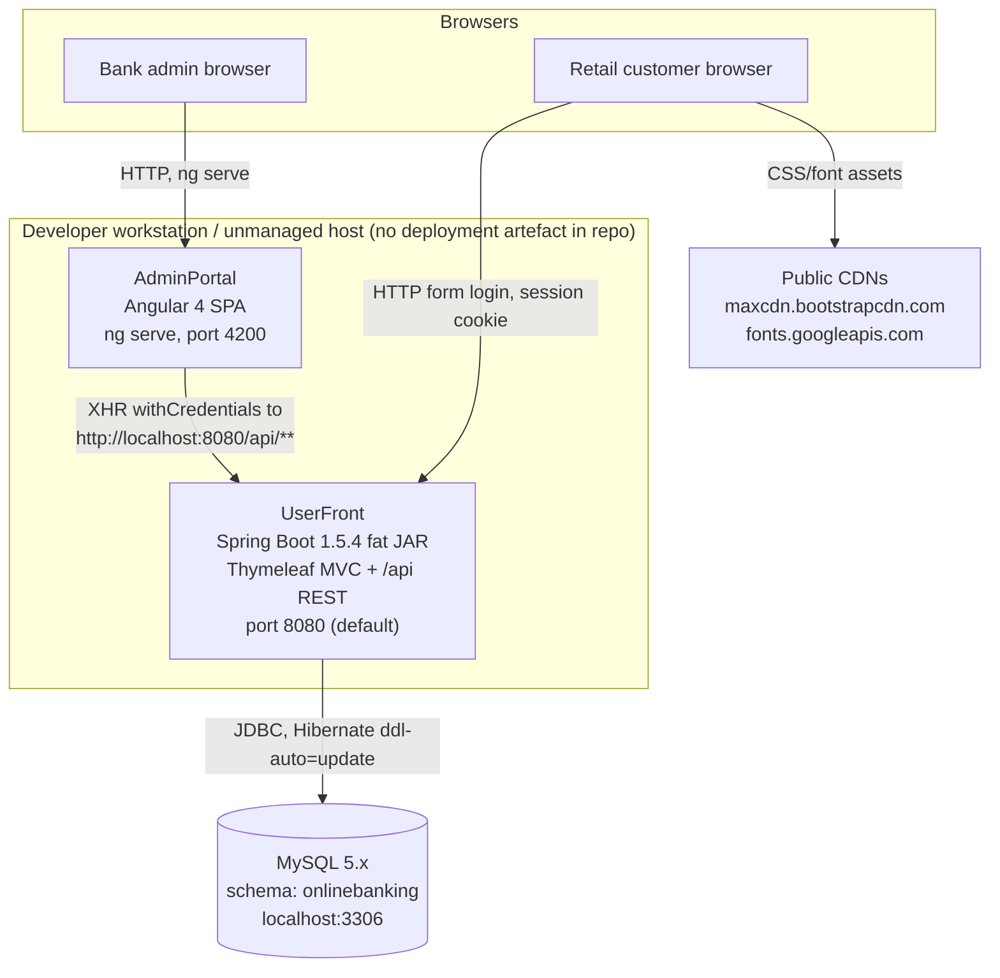
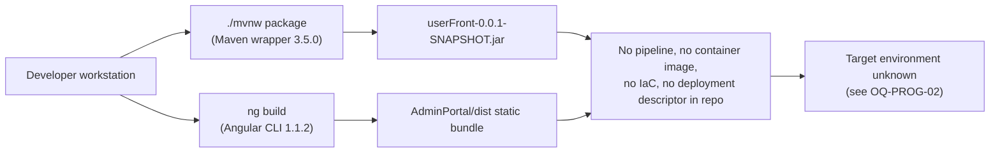

# Current State Architecture — Online Banking (UserFront + AdminPortal)

**Scope:** everything below is derived from the contents of this repository at branch `master`. Every
factual claim carries a `file:line` citation. Anything not read directly from a file in this repo is
prefixed **Inference:** and must be confirmed by the owning role (see `open-questions.md`).

---

## 1. Context diagram

Mermaid source

## 2. Release flow (as the repository defines it)

Mermaid source

**Inference:** the release path above is a description of the *absence* of automation, not of an
observed process. The repository contains no CI configuration, no container build, and no deployment
descriptor of any kind (see the zero-count table in §7), so how a build reaches any environment today
cannot be established from the code.

---

## 3. Components

| Component | Type | Evidence |
|---|---|---|
| `UserFront` | Spring Boot application, `jar` packaging, customer-facing Thymeleaf UI plus an `/api` REST surface | `UserFront/pom.xml:9`, `UserFront/pom.xml:11`, `UserFront/src/main/java/com/userFront/UserFrontApplication.java:6-11` |
| `AdminPortal` | Angular SPA consumed by bank staff | `AdminPortal/package.json:2`, `AdminPortal/.angular-cli.json:3-5` |
| MySQL schema `onlinebanking` | Single relational datastore shared by the whole system | `UserFront/src/main/resources/application.properties:8` |

Two "servers" is the README's framing (`README.md:5-8`); the manifests show one deployable JVM
process (`UserFront/pom.xml:9`) and one static SPA build (`AdminPortal/package.json:8`) — the
AdminPortal has no backend of its own and calls `UserFront` directly
(`AdminPortal/src/app/user.service.ts:11`).

---

## 4. Runtimes, frameworks and EOL status

| Runtime / framework | Version in repo | Evidence | EOL status |
|---|---|---|---|
| Java | 1.8 | `UserFront/pom.xml:24` | Public updates from the reference implementation ended long before the current date; **Inference:** the organisation is assumed to require Java 17 or 21 — confirm via OQ-PLAT-03 |
| Spring Boot | 1.5.4.RELEASE (June 2017) | `UserFront/pom.xml:17` | End of life; Spring Boot 1.x has received no OSS or commercial patches for years. **Inference:** on that basis it is unpatched against all CVEs disclosed since |
| Spring Security | inherited from Boot 1.5.4 via starter | `UserFront/pom.xml:53-56` | Configured through `WebSecurityConfigurerAdapter` (`UserFront/src/main/java/com/userFront/config/SecurityConfig.java:23`), a class removed in Spring Security 6 |
| Hibernate / Spring Data JPA | inherited from Boot 1.5.4 | `UserFront/pom.xml:43-46` | Dialect pinned to `MySQL5Dialect` (`UserFront/src/main/resources/application.properties:34`) |
| Thymeleaf | inherited from Boot 1.5.4 | `UserFront/pom.xml:33-36` | Server-rendered customer UI (`UserFront/src/main/resources/templates/*.html`) |
| Servlet API | `javax.servlet.*` | `UserFront/src/main/java/com/userFront/config/RequestFilter.java:3-9` | Pre-Jakarta namespace; a Spring Boot 3 upgrade forces a `javax` → `jakarta` rename |
| JPA API | `javax.persistence.*` | `UserFront/src/main/java/com/userFront/domain/User.java:8-16` | Same Jakarta namespace break |
| MySQL JDBC driver | version managed by the Boot 1.5.4 parent (no explicit version) | `UserFront/pom.xml:48-51` | — |
| Maven wrapper | Apache Maven 3.5.0 | `UserFront/.mvn/wrapper/maven-wrapper.properties:1` | Downloads the distribution from `repo1.maven.org` at build time |
| Angular | `^4.0.0` | `AdminPortal/package.json:15-23` | Unsupported; `@angular/http` (`AdminPortal/package.json:20`, used at `AdminPortal/src/app/user.service.ts:2`) was removed from Angular entirely |
| Angular CLI | 1.1.2 with `.angular-cli.json` | `AdminPortal/package.json:30`, `AdminPortal/.angular-cli.json:1-2` | Pre-`angular.json` build configuration format |
| RxJS | `^5.1.0` with deep imports (`rxjs/Observable`) | `AdminPortal/package.json:26`, `AdminPortal/src/app/login.service.ts:3` | Pre-RxJS 6 import style |
| TypeScript | `~2.3.3` | `AdminPortal/package.json:47` | — |
| Protractor / Karma / Jasmine | `~5.1.2` / `~1.7.0` / `~2.6.2` | `AdminPortal/package.json:38-44` | Protractor is a deprecated e2e runner |

The README's claim of "Log4j" (`README.md:22`) is **not** borne out by the build: there is no Log4j
dependency or configuration file anywhere in the repository (zero matches, §7). Logging is SLF4J over
the Boot default (`UserFront/src/main/java/com/userFront/service/UserServiceImpl/UserServiceImpl.java:6-7,24`).

---

## 5. Datastore and data access

| Fact | Value | Evidence |
|---|---|---|
| Engine | MySQL, addressed as `jdbc:mysql://localhost:3306/onlinebanking` | `UserFront/src/main/resources/application.properties:8` |
| Credentials | Username and password are committed in plaintext in the properties file (values deliberately not reproduced here) | `UserFront/src/main/resources/application.properties:11-12` |
| Schema management | `spring.jpa.hibernate.ddl-auto = update` — Hibernate mutates the live schema at application start | `UserFront/src/main/resources/application.properties:31` |
| Dialect | `org.hibernate.dialect.MySQL5Dialect` | `UserFront/src/main/resources/application.properties:34` |
| SQL logging | `spring.jpa.show-sql = true` | `UserFront/src/main/resources/application.properties:26` |
| Connection validation | `testWhileIdle = true`, `validationQuery = SELECT 1` | `UserFront/src/main/resources/application.properties:15-16` |
| Migration tooling | None — no Flyway or Liquibase dependency and no migration directory | `UserFront/pom.xml:27-63` (dependency block, no migration tool) |

**Access method is 100% Spring Data derived-query repositories.** Eight `CrudRepository` interfaces,
no implementation classes:

| Repository | Derived queries | Evidence |
|---|---|---|
| `UserDao` | `findByUsername`, `findByEmail`, `findAll` | `UserFront/src/main/java/com/userFront/dao/UserDao.java:9-13` |
| `RoleDao` | `findByName` | `UserFront/src/main/java/com/userFront/dao/RoleDao.java:7-9` |
| `PrimaryAccountDao` | `findByAccountNumber` | `UserFront/src/main/java/com/userFront/dao/PrimaryAccountDao.java:6-8` |
| `SavingsAccountDao` | `findByAccountNumber` | `UserFront/src/main/java/com/userFront/dao/SavingsAccountDao.java:7-9` |
| `PrimaryTransactionDao` | `findAll` | `UserFront/src/main/java/com/userFront/dao/PrimaryTransactionDao.java:9-11` |
| `SavingsTransactionDao` | `findAll` | `UserFront/src/main/java/com/userFront/dao/SavingsTransactionDao.java:9-11` |
| `RecipientDao` | `findAll`, `findByName`, `deleteByName` | `UserFront/src/main/java/com/userFront/dao/RecipientDao.java:9-14` |
| `AppointmentDao` | `findAll` | `UserFront/src/main/java/com/userFront/dao/AppointmentDao.java:9-11` |

Entities: `User`, `PrimaryAccount`, `SavingsAccount`, `PrimaryTransaction`, `SavingsTransaction`,
`Recipient`, `Appointment`, plus `Role`, `Authority`, `UserRole`
(`UserFront/src/main/java/com/userFront/domain/`).

**This is the single most important migration fact in the package:** there is no raw SQL, no
`JdbcTemplate`, no `EntityManager`, no `@Query`, no `nativeQuery` and no stored procedure call
anywhere in the codebase (all zero — §7). A MySQL → PostgreSQL engine change therefore has no
application-query surface to rewrite; the work is confined to the dialect
(`UserFront/src/main/resources/application.properties:34`), the driver (`UserFront/pom.xml:48-51`),
the generated DDL, and data movement.

---

## 6. Interfaces and integrations

### 6.1 Inbound HTTP — server-rendered customer UI (`@Controller`)

| Route | Method | Handler | Evidence |
|---|---|---|---|
| `/`, `/index` | GET | redirect to login page | `UserFront/src/main/java/com/userFront/controller/HomeController.java:30-38` |
| `/signup` | GET, POST | self-registration, assigns `ROLE_USER` | `UserFront/src/main/java/com/userFront/controller/HomeController.java:40-71` |
| `/userFront` | GET | account dashboard | `UserFront/src/main/java/com/userFront/controller/HomeController.java:73-83` |
| `/account/primaryAccount`, `/account/savingsAccount` | GET | statements | `UserFront/src/main/java/com/userFront/controller/AccountController.java:35-60` |
| `/account/deposit`, `/account/withdraw` | GET, POST | money movement | `UserFront/src/main/java/com/userFront/controller/AccountController.java:62-92` |
| `/transfer/betweenAccounts` | GET, POST | own-account transfer | `UserFront/src/main/java/com/userFront/controller/TransferController.java:32-51` |
| `/transfer/recipient`, `/recipient/save`, `/recipient/edit`, `/recipient/delete` | GET/POST | recipient management | `UserFront/src/main/java/com/userFront/controller/TransferController.java:53-102` |
| `/transfer/toSomeoneElse` | GET, POST | third-party transfer | `UserFront/src/main/java/com/userFront/controller/TransferController.java:104-124` |
| `/appointment/create` | GET, POST | book a banker appointment | `UserFront/src/main/java/com/userFront/controller/AppointmentController.java:30-53` |
| `/user/profile` | GET, POST | profile view and edit | `UserFront/src/main/java/com/userFront/controller/UserController.java:22-45` |

### 6.2 Inbound HTTP — REST surface consumed by AdminPortal (`@RestController`)

| Route | Method | Authorisation | Evidence |
|---|---|---|---|
| `/api/user/all` | GET | `hasRole('ADMIN')` at class level | `UserFront/src/main/java/com/userFront/resource/UserResource.java:19-33` |
| `/api/user/primary/transaction?username=` | GET | as above | `UserFront/src/main/java/com/userFront/resource/UserResource.java:35-38` |
| `/api/user/savings/transaction?username=` | GET | as above | `UserFront/src/main/java/com/userFront/resource/UserResource.java:40-43` |
| `/api/user/{username}/enable` | any (GET in practice) | as above | `UserFront/src/main/java/com/userFront/resource/UserResource.java:45-48` |
| `/api/user/{username}/disable` | any (GET in practice) | as above | `UserFront/src/main/java/com/userFront/resource/UserResource.java:50-53` |
| `/api/appointment/all` | any | `hasRole('ADMIN')` | `UserFront/src/main/java/com/userFront/resource/AppointmentResource.java:14-27` |
| `/api/appointment/{id}/confirm` | any | as above | `UserFront/src/main/java/com/userFront/resource/AppointmentResource.java:29-32` |

Method-level security is enabled globally
(`UserFront/src/main/java/com/userFront/config/SecurityConfig.java:22`), and every non-public route
requires authentication (`UserFront/src/main/java/com/userFront/config/SecurityConfig.java:56-57`)
with the public allowlist at `SecurityConfig.java:38-49`.

### 6.3 Outbound integrations

| Direction | Target | Evidence |
|---|---|---|
| AdminPortal → UserFront | `http://localhost:8080/api/user/*` and `/index`, `/logout`, hard-coded in five service methods | `AdminPortal/src/app/user.service.ts:11,16,21,26,31`; `AdminPortal/src/app/login.service.ts:11,22`; `AdminPortal/src/app/appointment.service.ts:11,16` |
| UserFront → MySQL | JDBC | `UserFront/src/main/resources/application.properties:8` |
| Customer browser → public CDNs | `maxcdn.bootstrapcdn.com` (Font Awesome 4.6.1), `fonts.googleapis.com` (two font families) | `UserFront/src/main/resources/templates/common/header.html:16,19,21` |
| Build → Maven Central | Maven distribution and all dependencies | `UserFront/.mvn/wrapper/maven-wrapper.properties:1` |

There are **no** server-side outbound integrations at all: no HTTP client, no mail sender, no message
broker, no cache, no object store, no file share and no FTP (§7). The only external network
dependency the running backend has is its database.

---

## 7. Zero-count negatives (load-bearing migration facts)

Each row is a repository-wide search (excluding `.git`) that returned **zero** matches. Each absence
removes a workstream that a migration of this shape would normally carry.

| Searched for | Matches | Why it matters |
|---|---|---|
| `@Scheduled` | 0 | No batch or cron workload to re-home; no scheduler leader-election problem |
| `RestTemplate`, `WebClient` | 0 | No outbound service-to-service HTTP; no egress allowlist to reproduce |
| `JdbcTemplate`, `EntityManager` | 0 | No hand-written data access outside Spring Data |
| `@Query`, `nativeQuery` | 0 | No dialect-specific SQL — the RDBMS change is low application risk |
| Stored-procedure invocation | 0 | Nothing to port to PostgreSQL PL/pgSQL |
| `JavaMailSender`, any `mail.` property | 0 | No SMTP dependency to broker with a mail relay |
| Kafka, RabbitMQ, JMS | 0 | No messaging middleware |
| Redis or any cache client | 0 | Sessions are not externalised (see §8) |
| `new File(`, `FileWriter`, FTP | 0 | No local-disk or file-transfer state to migrate |
| `Dockerfile`, `docker-compose*` | 0 | No container image exists today |
| Kubernetes / Helm manifests (`*.yml`, `*.yaml`) | 0 | No orchestration descriptor of any kind in the repo |
| Terraform / CloudFormation (`*.tf`) | 0 | Zero infrastructure as code |
| `Jenkinsfile`, `.github/`, any CI config | 0 | No pipeline; nothing to migrate off, everything to build |
| Shell scripts (`*.sh`) other than `mvnw` | 0 | No operational scripting to translate |
| `server.port` setting | 0 | Port 8080 is the Spring Boot default; the AdminPortal's hard-coded `:8080` (`AdminPortal/src/app/user.service.ts:11`) is consistent with it |
| Log4j dependency or config | 0 | Contradicts `README.md:22` |
| `auth0` usage in TypeScript | 0 | `auth0-js@^8.8.0` is declared (`AdminPortal/package.json:24`) but never imported — dead dependency |

---

## 8. Authentication, session and state

| Fact | Evidence |
|---|---|
| Form login against a database-backed `UserDetailsService`; BCrypt password hashing | `UserFront/src/main/java/com/userFront/config/SecurityConfig.java:61,70-74`; `UserFront/src/main/java/com/userFront/service/UserServiceImpl/UserSecurityService.java:14-31` |
| BCrypt encoder is constructed with a `SecureRandom` seeded from the constant string `"salt"` | `UserFront/src/main/java/com/userFront/config/SecurityConfig.java:31,35` |
| CSRF protection disabled; CORS support disabled in Spring Security | `UserFront/src/main/java/com/userFront/config/SecurityConfig.java:60` |
| CORS is instead applied by a hand-written servlet filter that hard-codes `Access-Control-Allow-Origin: http://localhost:4200` together with `Allow-Credentials: true` | `UserFront/src/main/java/com/userFront/config/RequestFilter.java:23,27` |
| `remember-me` enabled | `UserFront/src/main/java/com/userFront/config/SecurityConfig.java:65` |
| AdminPortal keeps only a boolean login marker in `localStorage`; the real credential is the `UserFront` session cookie sent with `withCredentials: true` | `AdminPortal/src/app/login/login.component.ts:17,28`; `AdminPortal/src/app/navbar/navbar.component.ts:15,25`; `AdminPortal/src/app/user.service.ts:12` |
| Account numbers are allocated from a `static int` counter held in the JVM | `UserFront/src/main/java/com/userFront/service/UserServiceImpl/AccountServiceImpl.java:24,105-107` |
| `User.toString()` includes the password field | `UserFront/src/main/java/com/userFront/domain/User.java:161-174` |

**Inference:** with no Redis, JDBC or other session store configured (§7 shows zero cache clients and
the properties file configures only the datasource), HTTP sessions are held in the servlet
container's in-memory store. That makes the application **stateful per instance**: horizontal scaling
requires either sticky sessions or session externalisation. This must be confirmed against the real
runtime by Application Owner / Platform Engineering (OQ-PLAT-02).

**Inference:** the `static int nextAccountNumber` counter
(`AccountServiceImpl.java:24`) is per-JVM and is not seeded from the database, so two concurrent
instances would issue colliding account numbers and a restart would reset the sequence. This is a
correctness blocker for running more than one replica, independent of AWS.

---

## 9. Configuration and secrets

| Fact | Evidence |
|---|---|
| All backend configuration lives in one committed properties file; there are no Spring profiles and no environment-specific overrides | `UserFront/src/main/resources/application.properties:1-35` (single file; no `application-*.properties` exists) |
| Database credentials are committed in that file in plaintext | `UserFront/src/main/resources/application.properties:11-12` |
| No externalised configuration mechanism (no env-var placeholders, no config server, no secrets client) | same file, lines 1-35 |
| The Angular environment files carry only a `production` boolean — no API base URL, so backend addresses are hard-coded in source | `AdminPortal/src/environments/environment.ts:6-8`, `AdminPortal/src/environments/environment.prod.ts:1-3`, versus `AdminPortal/src/app/user.service.ts:11` |
| The CORS origin is likewise hard-coded rather than configured | `UserFront/src/main/java/com/userFront/config/RequestFilter.java:23` |

Because the committed credential is in version control, it must be treated as compromised. It is
carried into `migration-plan.md` as rotate-and-revoke work (WS1). The value is not reproduced in this
package.

---

## 10. Contradictions between artefacts

These are recorded as current-state facts, not as defects to fix in this docs-only change.

| # | Contradiction | Evidence |
|---|---|---|
| C1 | `README.md:22` lists Log4j in the back-end stack; the build declares no logging dependency at all and no Log4j configuration file exists (§7). The code uses SLF4J | `README.md:22` vs `UserFront/pom.xml:27-63`, `UserFront/src/main/java/com/userFront/service/UserServiceImpl/UserServiceImpl.java:6-7` |
| C2 | `README.md:5-8` describes "two separate servers"; only one server-side deployable exists — the AdminPortal is a static SPA with no backend of its own | `README.md:5-8` vs `AdminPortal/package.json:5-12`, `AdminPortal/src/app/user.service.ts:11` |
| C3 | Spring Security is configured with CORS disabled, while a separate servlet filter emits CORS headers with credentials allowed — two mechanisms with opposite intent, only one of them enforcing anything | `UserFront/src/main/java/com/userFront/config/SecurityConfig.java:60` vs `UserFront/src/main/java/com/userFront/config/RequestFilter.java:23-27` |
| C4 | `spring-boot-starter-jdbc` and `spring-boot-starter-data-jpa` are both declared, but no JDBC-template code exists — the JDBC starter is redundant | `UserFront/pom.xml:38-46` vs zero `JdbcTemplate` matches (§7) |
| C5 | `auth0-js` is a production dependency of the AdminPortal, yet authentication is Spring Security form login against the UserFront session — Auth0 is never imported | `AdminPortal/package.json:24` vs `AdminPortal/src/app/login.service.ts:10-19` |
| C6 | State-changing operations (`enable`, `disable`, `confirm`) are exposed on mappings with no HTTP method restriction and are invoked over `GET` by the SPA | `UserFront/src/main/java/com/userFront/resource/UserResource.java:45,50` and `AppointmentResource.java:29` vs `AdminPortal/src/app/user.service.ts:27,32` |
| C7 | Recipient lookup, edit and delete resolve a recipient by name globally rather than within the authenticated user's own recipient list, even though the principal is available in the same method | `UserFront/src/main/java/com/userFront/controller/TransferController.java:79,93` and `UserFront/src/main/java/com/userFront/dao/RecipientDao.java:12-14` |
| C8 | The repository still carries Eclipse WTP project metadata (`.project`, `.settings/`) describing a JavaScript-nature project named "Online Banking", which matches neither module's build tooling | `.project:1-17`, `.settings/.jsdtscope` |

---

## 11. Testing and quality gates

| Fact | Evidence |
|---|---|
| Backend test suite is a single Spring context-load test with no assertions | `UserFront/src/test/java/com/userFront/UserFrontApplicationTests.java:10-14` |
| 37 backend Java source files, 28 AdminPortal TypeScript files | file counts under `UserFront/src/main/java` and `AdminPortal/src` |
| AdminPortal has 10 generated `.spec.ts` files (CLI scaffolding) and a Protractor e2e stub | `AdminPortal/src/app/*.spec.ts`, `AdminPortal/e2e/app.e2e-spec.ts`, `AdminPortal/protractor.conf.js:15` |
| No coverage gate, no lint gate, no static analysis configuration is enforced anywhere — `ng lint` exists as a script but nothing runs it | `AdminPortal/package.json:10`, and zero CI configuration (§7) |

**Inference:** with one non-asserting backend test and no pipeline, there is no automated regression
signal available to protect a runtime, framework or database migration. Building that signal is
sequenced first in the migration plan (WS1) for exactly this reason.

---

## 12. Static content and assets

| Fact | Evidence |
|---|---|
| ~1.3 MB of vendored front-end assets (Bootstrap, jQuery, DataTables, glyphicon fonts) are served from the Spring Boot JAR | `UserFront/src/main/resources/static/{css,js,fonts,images}` |
| The AdminPortal vendors a further ~492 KB of the same libraries into its own assets folder | `AdminPortal/src/assets/{css,js,fonts}` |
| Thymeleaf templates additionally pull Font Awesome and Google Fonts from public CDNs at page render | `UserFront/src/main/resources/templates/common/header.html:16,19,21` |

Serving static assets from the application JVM is a cost and latency item for the target design, and
the CDN references are an egress dependency that a private-networking baseline has to account for
(see `target-state.md`).
