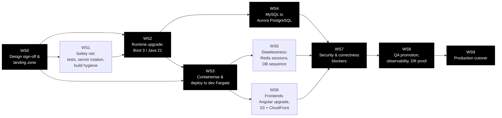
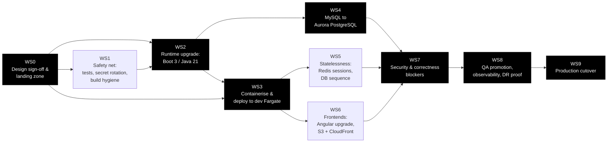

# Migration Plan — Online Banking to AWS

Ordered workstreams, each independently reviewable and each with explicit entry criteria. Effort is
expressed in engineering sessions (a session is a focused unit of work of roughly one to two
human-weeks of equivalent scope); calendar duration is dominated by external waits — account vending,
approvals and change windows — which are called out separately.

---

## Dependency graph

Mermaid source

**Critical path:** WS0 → WS2 → WS3 → WS4 → WS7 → WS8 → WS9. WS1 runs alongside WS0/WS2 but gates WS2's
merge; WS5 and WS6 are parallelisable against WS4 and only converge at WS7. The longest *calendar*
item on the path is not engineering work — it is Control Tower account vending in WS0 (OQ-PROG-03)
and the change-approval window in WS9 (OQ-DEL-03).

---

## WS0 — Design sign-off and landing zone

**Entry criteria:** this architecture package reviewed; **OQ-PROG-01** (real approved service list),
**OQ-PLAT-01** (real guardrails) and **OQ-PROG-02** (what is actually deployed today) answered.

Until OQ-PROG-01 and OQ-PLAT-01 are answered, every service choice in `target-state.md` rests on an
assumption authored for this package. Re-derive §1, §4 and §5 of that document against the real list
before anything is built.

Scope:
- Confirm or replace the assumed service list and guardrails; reissue the target-state mapping.
- Answer **OQ-DB-01** (RTO/RPO) and **OQ-PLAT-06** (regions) — together these fix the resilience
  topology and the bulk of the run cost.
- Request Control Tower vending of the **dev** account (guardrail G4 — QA comes only once dev is
  demonstrably running).
- Terraform skeleton: VPC with private subnets, VPC endpoints, KMS keys, mandatory tagging via
  provider default tags (**OQ-OPS-01**), state backend per **OQ-PLAT-04**.
- Agree the CI/CD tool and runner identity (**OQ-DEL-01**) and approved artifact sources
  (**OQ-DEL-02**).

**Exit criteria:** dev account vended and reachable; Terraform applies cleanly from a pipeline using
an OIDC role with no static credentials; guardrail table re-signed against the real policy.

**Effort:** 2 sessions of engineering; calendar paced by vending lead time.

---

## WS1 — Safety net: regression tests, secret rotation, build hygiene

**Entry criteria:** WS0 started (does not need the AWS account). **OQ-SEC-01** owner identified.

The codebase has exactly one backend test and it asserts nothing
(`UserFront/src/test/java/com/userFront/UserFrontApplicationTests.java:10-14`), and no pipeline runs
anything. Every later workstream — a framework major upgrade, a database engine change, an Angular
rewrite — is a large refactor performed with no regression signal. Building that signal first is the
cheapest risk reduction available.

Scope:
- Characterisation tests over the money-movement and authorisation paths that later workstreams will
  disturb: deposit/withdraw (`AccountServiceImpl.java:58-103`), both transfer flows
  (`TransactionServiceImpl.java:77,124`), signup and role assignment (`HomeController.java:49-71`),
  and the `/api` admin surface (`UserResource.java:19-53`).
- Rotate and revoke the credential committed at
  `UserFront/src/main/resources/application.properties:11-12`; treat it as compromised regardless of
  whether it was ever used in production (**OQ-SEC-01**). Externalise configuration to environment
  variables now so the file no longer needs to hold a value.
- Stand up the pipeline shell on the approved tool: build, test, dependency scan, lint (**OQ-DEL-04**).
- Remove the dead `auth0-js` dependency (`AdminPortal/package.json:24`) and the redundant
  `spring-boot-starter-jdbc` (`UserFront/pom.xml:38-41`); delete the stale Eclipse WTP metadata
  (`.project`, `.settings/`).

**Exit criteria:** pipeline green on `master`; the committed credential is revoked at the database and
no longer valid anywhere; coverage baseline recorded for the paths listed above.

**Effort:** 2 sessions.

---

## WS2 — Runtime upgrade: Spring Boot 3.x on Java 21

**Entry criteria:** WS1 exit criteria met (there must be a regression signal before this starts);
**OQ-PLAT-03** answered.

Scope:
- Spring Boot 1.5.4 (`UserFront/pom.xml:17`) → 3.x; Java 8 (`UserFront/pom.xml:24`) → the approved LTS.
- `javax.*` → `jakarta.*` across the servlet filter (`RequestFilter.java:3-9`) and all JPA entities
  (`User.java:8-16` and the rest of `domain/`).
- Replace `WebSecurityConfigurerAdapter` (`SecurityConfig.java:23`) with the component-based
  `SecurityFilterChain` configuration.
- Replace the constant-seeded BCrypt encoder (`SecurityConfig.java:31,35`) with the default
  constructor — existing hashes remain verifiable.
- Introduce Flyway and baseline the schema currently produced by
  `spring.jpa.hibernate.ddl-auto = update` (`application.properties:31`); switch the runtime setting
  to `validate`. Requires **OQ-DB-03** so the baseline reflects production, not a developer laptop.
- Turn off `spring.jpa.show-sql` (`application.properties:26`) and remove the `System.out.println`
  calls in service code (`UserServiceImpl.java:111,113`).

**Exit criteria:** application starts on the new runtime; WS1 tests pass unchanged; Flyway baseline
applies to a clean database and `validate` succeeds against a restored production-shaped schema.

**Effort:** 3 sessions.

---

## WS3 — Containerise and deploy to dev Fargate

**Entry criteria:** WS2 merged; dev account and VPC from WS0 available; approved base image known
(**OQ-DEL-02**).

Scope:
- Dockerfile from an approved base image; multi-stage build; non-root user; image published to ECR by
  the pipeline.
- Terraform for the ECS Fargate service, internal ALB, target group and health check, security groups,
  and an IAM task role scoped to Secrets Manager, CloudWatch Logs, KMS and nothing else.
- Aurora PostgreSQL dev cluster provisioned (empty at this stage) with credentials in Secrets Manager
  (`target-state.md` row 5).
- Multi-AZ in dev, per the stated dev posture.

**Exit criteria:** an image built by the pipeline runs on Fargate in the dev account, passes ALB health
checks, reads its database credential from Secrets Manager, and emits logs to CloudWatch. No public
endpoint exists.

**Effort:** 2 sessions.

---

## WS4 — MySQL to Aurora PostgreSQL

**Entry criteria:** WS2 merged (Flyway in place); **OQ-DB-02**, **OQ-DB-03**, **OQ-DB-04**,
**OQ-PROG-04** answered.

This is a workstream, not a configuration change — but it is materially cheaper than a typical engine
migration because the application has no engine-specific query surface: zero native SQL, zero stored
procedures, zero `@Query`, all access through Spring Data derived queries (`current-state.md` §5, §7).
The work is schema conversion, data movement and verification.

Scope:
- Convert the schema with SCT; hand-review type mappings (`BigDecimal` balances, `Date` columns on
  the transaction entities) and identifier casing.
- Swap the driver (`UserFront/pom.xml:48-51`) and remove the pinned `MySQL5Dialect`
  (`application.properties:34`) — Hibernate 6 resolves the dialect from the connection.
- Introduce RDS Proxy between the service and the cluster.
- DMS full load plus CDC from the production MySQL into Aurora; reconcile row counts and balance
  totals per account.
- Rehearse the cutover at least twice against a production-sized copy and record the achieved
  downtime against **OQ-OPS-04**.
- Confirm no other consumer reads the MySQL schema directly (**OQ-PROG-04**) — if one does, it becomes
  its own workstream.

**Exit criteria:** the application runs against Aurora PostgreSQL in dev with WS1 tests green; a
rehearsed migration reconciles exactly on row counts and monetary totals; measured cutover window fits
the agreed maintenance window.

**Effort:** 2 sessions plus data-volume-dependent DMS runtime.

---

## WS5 — Statelessness: externalised sessions and database-backed sequence

**Entry criteria:** WS3 complete; **OQ-PLAT-02** answered (confirming the in-memory-session inference).

Two defects make the application incorrect at more than one replica, which the target design requires
from dev onwards:

- HTTP sessions are held per instance (`current-state.md` §8) — every deployment or AZ event logs
  customers out, and no session survives a regional failover.
- Account numbers come from a `static int` in the JVM
  (`AccountServiceImpl.java:24,105-107`), so two replicas issue colliding numbers and a restart resets
  the sequence.

Scope:
- Spring Session backed by ElastiCache for Redis, encrypted in transit and at rest; migrate
  `remember-me` (`SecurityConfig.java:65`) to a persistent token store.
- Replace the counter with a PostgreSQL sequence seeded above the highest existing account number
  (**OQ-DB-04**), and verify no collision against migrated data.
- Scale the dev service to two tasks and prove session continuity and unique account allocation under
  a rolling deployment.

**Exit criteria:** two-task dev service holds sessions across a rolling deploy; concurrent signups
across both tasks produce no duplicate account numbers.

**Effort:** 2 sessions.

---

## WS6 — Frontends: Angular upgrade and static hosting

**Entry criteria:** WS3 complete (an ALB origin exists to route `/api` to).

Scope:
- Angular 4 (`AdminPortal/package.json:15-23`) upgraded to a supported version; `@angular/http`
  (`AdminPortal/package.json:20`, used at `AdminPortal/src/app/user.service.ts:2`) replaced with
  `HttpClient`; RxJS deep imports (`AdminPortal/src/app/login.service.ts:3`) modernised;
  `.angular-cli.json` migrated to `angular.json`; Protractor replaced.
- Move the hard-coded `http://localhost:8080` URLs (`user.service.ts:11,16,21,26,31`,
  `login.service.ts:11,22`, `appointment.service.ts:11,16`) into the environment files, which today
  carry only a `production` flag (`environment.ts:6-8`).
- Publish the bundle to a private S3 bucket behind CloudFront with OAC and WAF; add the ALB as a
  second origin on `/api/*` so the SPA and API are same-origin.
- Delete the hand-written CORS filter (`RequestFilter.java:23-27`) — same-origin routing removes the
  need for it, and the hard-coded `localhost:4200` origin cannot function in AWS anyway.
- Self-host the Font Awesome and Google Fonts assets currently pulled from public CDNs
  (`templates/common/header.html:16,19,21`) per guardrail G9.

**Exit criteria:** admin portal served from CloudFront reaches `/api` same-origin with no CORS headers
in play; customer Thymeleaf pages render with no third-party CDN requests.

**Effort:** 3 sessions.

---

## WS7 — Security and correctness blockers

**Entry criteria:** WS4, WS5 and WS6 complete; **OQ-SEC-03** risk owner named; **OQ-SEC-02** answered.

These are application defects found during the current-state review. They are deliberately excluded
from the docs-only PR that carries this package, and production cutover (WS9) is gated on all of them.

| Item | Evidence | Fix |
|---|---|---|
| CSRF disabled while state-changing operations are exposed over `GET` | `SecurityConfig.java:60`; `UserResource.java:45,50`; `AppointmentResource.java:29`; called by `user.service.ts:27,32` | Re-enable CSRF; move mutations to `POST`/`PUT`/`DELETE`; update the SPA callers |
| Recipient lookup, edit and delete are not scoped to the authenticated user | `TransferController.java:79,93`; `RecipientDao.java:12-14` | Scope every recipient query by owning user; the principal is already in scope in those methods |
| `User.toString()` includes the password field | `User.java:161-174` | Redact before logs are shipped to CloudWatch (WS8) |
| Admin plane shares the customer identity store and session cookie | `login.service.ts:10-19`; `SecurityConfig.java:61` | Federate staff access to the enterprise IdP or Cognito (**OQ-SEC-02**) |
| Signup binds the whole `User` entity from the request | `HomeController.java:50`, binding `User` which carries `enabled` and `userRoles` (`User.java:41,58`) | Bind a signup DTO instead of the persistent entity |
| Deposit, withdraw and transfer parse amounts with no validation | `AccountController.java:73,90`; `TransferController.java:48` | Validate sign, scale and sufficient funds server-side |

**Exit criteria:** every row fixed with a regression test; dependency and SAST scans clean at the
agreed threshold (**OQ-DEL-04**); Security sign-off recorded (**OQ-SEC-04** if a pen test is required).

**Effort:** 3 sessions.

---

## WS8 — QA promotion, observability and DR proof

**Entry criteria:** WS7 complete; dev demonstrably running and promoting (guardrail G4), so QA account
vending can be requested; **OQ-OPS-01**, **OQ-OPS-03** answered.

Scope:
- QA account vended; the same Terraform applied with QA variables; pipeline promotes the *same image
  digest* dev → QA (no rebuild).
- CloudWatch dashboards, alarms and X-Ray tracing (`target-state.md` row 20); log retention per
  **OQ-OPS-05**; structured logging with the WS7 redaction in place.
- AWS Backup plan plus Aurora PITR, and a **restore actually performed** and timed against
  **OQ-DB-01**.
- Multi-region prod topology built and exercised in QA scale: Aurora Global Database, second-region
  ECS service, Route 53 failover — with a **documented failover test**, not a design review.
- Load test to the volumes from **OQ-OPS-03**; size Fargate tasks and Aurora capacity from the result.
- On-call, alert thresholds and escalation agreed (**OQ-OPS-02**).

**Exit criteria:** promotion from dev to QA by digest with no manual step; restore and regional
failover both demonstrated and timed within RTO/RPO; alarms firing to the real on-call destination.

**Effort:** 3 sessions.

---

## WS9 — Production cutover (final workstream)

**Entry criteria — all must be true; cutover cannot start otherwise:**

1. **WS7 closed in full.** CSRF and HTTP verbs corrected, recipient authorisation scoped, credential
   logging redacted, signup mass assignment closed, amount validation in place — each with a
   regression test and Security sign-off (**OQ-SEC-03**).
2. **The committed database credential has been rotated and revoked** (WS1, **OQ-SEC-01**) and is
   proven invalid against every environment.
3. **Statelessness proven** (WS5): sessions survive a rolling deploy at two or more tasks, and account
   numbers are allocated from a database sequence with no collision against migrated data.
4. **Production entry criteria met** (guardrail G7): multi-region topology live, load balancing in
   front of every service, and a **DR/failover test plus a backup restore demonstrated and timed**
   within the agreed RTO/RPO (**OQ-DB-01**) — evidence recorded, not asserted.
5. **Prod account vended and promoted to** via the same Terraform and the same image digest that
   passed QA; no console-built resources anywhere (guardrail G5).
6. **Data migration rehearsed at least twice** against production-sized data with exact reconciliation
   on row counts and monetary totals, and a measured cutover window inside the approved maintenance
   window (**OQ-OPS-04**).
7. **Change approval granted** through the organisation's change process (**OQ-DEL-03**), with the
   window booked and the rollback plan approved.
8. **On-call live** (**OQ-OPS-02**) with alarms routing to the real destination before traffic moves.
9. **No direct consumers of the legacy MySQL schema remain unmigrated** (**OQ-PROG-04**).

Cutover sequence:
1. Freeze changes; announce the window.
2. Put the legacy application into read-only or take it down, per the rehearsed plan.
3. Stop DMS CDC once lag reaches zero; run final reconciliation.
4. Point Route 53 at CloudFront; enable the ECS production service; verify synthetic transactions —
   login, deposit, withdraw, both transfer paths, appointment booking, admin enable/disable.
5. Monitor for the agreed soak period with the legacy stack still restorable.
6. Decommission the legacy stack only after the soak period passes, retaining a final MySQL backup for
   the retention period (**OQ-OPS-05**).

**Rollback:** until step 6, rollback is a Route 53 change back to the legacy stack plus a replay of
writes captured during the soak — which is why the legacy database must remain intact and the soak
period must be agreed in advance.

**Exit criteria:** production traffic served from AWS through the full soak period with alarms clean;
legacy stack decommissioned; final backup retained; runbook handed to Operations.

**Effort:** 2 sessions plus the change window.
