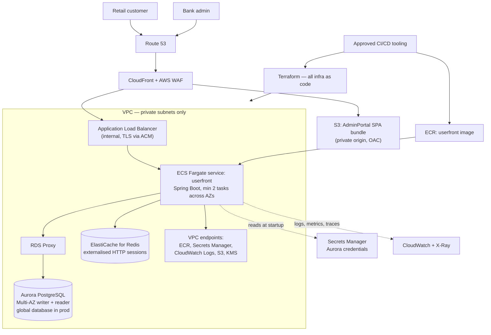

# Target State Architecture on AWS — Online Banking

> **ASSUMPTION NOTICE.** The customer supplied neither an approved ("blessed") AWS service list nor a
> set of platform migration guardrails. Everything in §1 and §2 below is an **explicitly assumed**
> baseline authored for this package. It is **not** the customer's policy and must not be presented
> as such. Confirming or replacing it is open question **OQ-PROG-01** (service list) and
> **OQ-PLAT-01** (guardrails) in `open-questions.md`, and is the first gate in the migration plan.

---

## 1. ASSUMED approved AWS service list

Only services on this list appear in the target design. Where the natural choice falls outside it,
the row is tagged `OFF-LIST?` and an in-list alternative is proposed rather than substituted
silently.

| Domain | Assumed-approved services |
|---|---|
| Compute | Amazon ECS on AWS Fargate |
| Containers | Amazon ECR |
| Data | Amazon Aurora PostgreSQL (Serverless v2 or provisioned), Amazon RDS Proxy |
| Networking | Amazon VPC, Application Load Balancer, AWS PrivateLink / VPC endpoints, Amazon Route 53, Amazon CloudFront, AWS WAF |
| Storage | Amazon S3 |
| Identity & secrets | AWS IAM, AWS Secrets Manager, AWS KMS, Amazon Cognito |
| Caching / session | Amazon ElastiCache for Redis |
| Observability | Amazon CloudWatch (Logs, Metrics, Alarms), AWS X-Ray |
| Governance | AWS Organizations, AWS Control Tower, AWS Config, AWS CloudTrail, AWS Backup |
| Migration tooling | AWS Database Migration Service (DMS), AWS Schema Conversion Tool (SCT) |
| Delivery | The organisation's approved CI/CD tooling (assumed external to AWS), Terraform |

**Assumed environment posture** (stated by the requester, carried as assumptions):
multi-AZ in dev, multi-region in prod; Aurora PostgreSQL as the target RDBMS; ECS Fargate as the
target compute; Terraform as the IaC tool; CD through the organisation's approved pipeline tooling.

---

## 2. Platform migration guardrails in force

**These are the playbook's default guardrail set, used because the customer supplied none. They are
assumptions, not customer policy** (OQ-PLAT-01).

| # | Guardrail (assumed default) |
|---|---|
| G1 | **Approved-service allowlist** — only services on the approved list may appear in the target architecture; the allowlist is assumed to be enforced organisation-wide by service control policies (SCPs) |
| G2 | **Containers first** — the approved managed container platform is the preferred compute target; VM-based lift-and-shift requires explicit justification |
| G3 | **Standard target RDBMS** — relational workloads target the organisation's standard engine (PostgreSQL); staying on a non-standard engine is a justified, flagged exception |
| G4 | **Account vending and environment promotion** — onboarding via the standard account-vending process (AWS Control Tower) with separate dev, QA and prod accounts; dev must be running before QA is granted; changes promote dev → QA → prod |
| G5 | **Everything as code** — all target infrastructure defined in the approved IaC tool (Terraform); no console-built resources |
| G6 | **Approved delivery toolchain** — CI/CD runs on the organisation's approved pipeline tooling; migrating off legacy pipelines is part of the plan |
| G7 | **Production entry criteria** — prod requires the stated resilience posture (multi-region), load balancing, and a demonstrated DR/failover test before approval |
| G8 | **Security baseline** — private networking by default, encryption in transit and at rest, least-privilege IAM roles with no long-lived static credentials, secrets in the approved secrets manager and never in code or config |
| G9 | **Approved artifact sources** — container images and dependencies only from approved registries/repositories |
| G10 | **Tagging and observability standards** — mandatory tag set (owner, cost centre, environment, data classification) and logs/metrics to the central observability platform |

---

## 3. Target architecture diagram

Mermaid source

---

## 4. Component-by-component target mapping

Risk is the migration risk of moving that component, not the risk of leaving it alone. Effort is
rough and assumes one engineer working with the codebase as it stands; ranges are indicative and
should be re-baselined once OQ-PROG-01/02 are answered.

| # | Current component | Target AWS service | Rationale | Risk | Effort |
|---|---|---|---|---|---|
| 1 | UserFront Spring Boot 1.5.4 fat JAR, no container (`UserFront/pom.xml:9,17`; zero Dockerfiles) | **ECS Fargate** service behind an internal ALB, image in **ECR** | G2 containers-first; no VM lift-and-shift justification exists because there is nothing being lifted — no deployment artefact exists today, so a container is the cheapest first artefact. Fargate removes node patching from a team that currently has no infrastructure automation at all | **H** — the framework upgrade is a hard prerequisite (row 2), not the containerisation itself | 1–2 sessions to containerise and deploy, once row 2 lands |
| 2 | Spring Boot 1.5.4 on Java 8 (`UserFront/pom.xml:17,24`), `javax.*` namespace (`RequestFilter.java:3-9`, `User.java:8-16`), `WebSecurityConfigurerAdapter` (`SecurityConfig.java:23`) | Not an AWS service — a **prerequisite upgrade** to a supported Spring Boot 3.x on Java 21, running on Fargate | G8 requires a patchable runtime; an EOL framework cannot meet a security baseline. Aurora PostgreSQL support, current JDBC drivers and modern observability agents all assume the newer stack | **H** — Jakarta namespace change, Spring Security config rewrite, no regression test suite to catch breakage (`UserFrontApplicationTests.java:10-14`) | 2–3 sessions |
| 3 | MySQL 5.x, schema `onlinebanking` (`application.properties:8,34`) | **Aurora PostgreSQL** (Multi-AZ; Aurora Global Database in prod), fronted by **RDS Proxy** | G3 standard RDBMS. Critically de-risked by the code: zero native SQL, zero stored procedures, zero `@Query` — all access is Spring Data derived queries (`dao/*.java`), so only the dialect, driver and generated DDL change. RDS Proxy absorbs connection churn from scaled-out Fargate tasks | **M** — schema/data conversion and type mapping are real work; the application query surface is not | 1–2 sessions for schema + cutover rehearsal, plus data-volume-dependent DMS runtime (OQ-DB-02) |
| 4 | `spring.jpa.hibernate.ddl-auto = update` mutating the live schema at startup (`application.properties:31`) | **Flyway** (or Liquibase) migrations executed as a separate ECS task, DDL privileges removed from the application role | G5 everything-as-code and G8 least privilege: an application that can rewrite its own production schema cannot be granted least-privilege database rights. Also a prerequisite for a repeatable dev → QA → prod promotion (G4) | **M** | 1 session (baseline the existing generated schema, then forward-only) |
| 5 | Plaintext DB credentials committed to source (`application.properties:11-12`) | **Secrets Manager** + IAM task role; rotation enabled; **KMS** CMK | G8 explicitly forbids secrets in code or config. The committed value must additionally be rotated and revoked as remediation work, not merely relocated | **L** to implement, **H** in exposure until rotated | <1 session to wire; rotation is a WS1 gate |
| 6 | AdminPortal Angular 4 SPA served by `ng serve` (`AdminPortal/package.json:15-23,30`) | **S3** private bucket + **CloudFront** (OAC) + **AWS WAF** | Static bundle needs no compute. CloudFront gives TLS, WAF and edge caching with no server to patch. Angular 4 and `@angular/http` are removed-from-Angular APIs, so a framework upgrade is a prerequisite to any supported build | **M** — the SPA upgrade is the work, the hosting is not | 2 sessions (Angular upgrade dominates) |
| 7 | Backend API base URL hard-coded to `http://localhost:8080` in five service methods (`user.service.ts:11,16,21,26,31`; `login.service.ts:11,22`; `appointment.service.ts:11,16`) while the environment files carry only a `production` flag (`environment.ts:6-8`) | Same-origin `/api` path behind **CloudFront** with two origins (S3 for the bundle, ALB for `/api`), URLs moved into the Angular environment files | Same-origin removes the CORS problem entirely rather than porting it, and satisfies G8's private-networking default: the ALB stays internal and is reachable only through CloudFront | **L** | <1 session |
| 8 | Hand-written CORS filter hard-coding `Access-Control-Allow-Origin: http://localhost:4200` with `Allow-Credentials: true` (`RequestFilter.java:23,27`), alongside `cors().disable()` in Spring Security (`SecurityConfig.java:60`) | Deleted; replaced by the same-origin CloudFront routing in row 7 (no AWS service required) | Resolves contradiction C3 and removes a hard-coded localhost origin that cannot work in any AWS environment | **L** | included in row 7 |
| 9 | In-memory HTTP sessions (**Inference**: no session store is configured; zero cache clients) with `remember-me` (`SecurityConfig.java:65`) | **ElastiCache for Redis** via Spring Session | Multi-AZ and multi-region (G7) mean tasks are replaced and traffic is shifted; in-memory sessions would log every customer out on each deploy or AZ event. Sticky sessions are the alternative but do not survive a regional failover | **M** | 1 session |
| 10 | `static int nextAccountNumber` allocating account numbers per JVM (`AccountServiceImpl.java:24,105-107`) | Database sequence in Aurora PostgreSQL | Correctness blocker for more than one task: two replicas would issue colliding account numbers and a restart resets the counter. Must be fixed before any horizontally scaled deployment, and therefore before prod entry (G7) | **H** — data-integrity impact; needs a seeded sequence that does not collide with existing rows | 1 session including a backfill check |
| 11 | Sensitive fields in `User.toString()` including the password (`User.java:161-174`) | Redaction, before logs are shipped to **CloudWatch Logs** | G10 centralises logs; centralising logs that may contain credentials makes the exposure worse, so redaction must precede the observability workstream | **L** to fix, **H** if shipped as-is | <1 session |
| 12 | State-changing admin operations exposed over `GET` (`UserResource.java:45,50`; `AppointmentResource.java:29`) with CSRF disabled (`SecurityConfig.java:60`) | Correct HTTP verbs + CSRF re-enabled; **AWS WAF** as defence in depth, not as the fix | G8 security baseline. WAF cannot compensate for a `GET` that disables a customer's account; the application-level fix is a prod-cutover gate | **M** | 1 session |
| 13 | Recipient lookup/edit/delete resolved by name globally rather than within the caller's own recipients (`TransferController.java:79,93`; `RecipientDao.java:12-14`) | No AWS service — authorisation fix, ownership-scoped queries | A broken-object-level-authorisation defect in a money-movement path. Not fixed in this docs-only PR, but prod cutover is explicitly gated on it | **H** | 1 session |
| 14 | Admin authentication via the customer application's form login and shared session cookie (`login.service.ts:10-19`; `SecurityConfig.java:61`) | **Cognito** (or the organisation's federated IdP) for staff access to the admin plane | Staff and customer identity planes should not share a credential store or session. `auth0-js` is declared but unused (`AdminPortal/package.json:24`) — dead dependency, remove | **M** — depends on OQ-SEC-02 (does an enterprise IdP already exist?) | 1–2 sessions |
| 15 | BCrypt encoder seeded from the constant `"salt"` (`SecurityConfig.java:31,35`) | No AWS service — use the default `BCryptPasswordEncoder(12)` constructor | A deterministic `SecureRandom` seed weakens hash generation. Existing hashes remain verifiable, so this is a forward-only change | **L** | <1 session |
| 16 | ~1.3 MB of vendored static assets served from the JVM (`UserFront/src/main/resources/static/`) plus CDN references to `maxcdn.bootstrapcdn.com` and `fonts.googleapis.com` (`templates/common/header.html:16,19,21`) | **S3** + **CloudFront** for the vendored assets; public-CDN references self-hosted | G8 private-by-default and G9 approved artifact sources: a regulated banking page should not depend on third-party CDN availability or leak customer page views to them. Self-hosting also removes the only browser-side egress dependency | **L** | <1 session |
| 17 | No CI/CD, no pipeline of any kind (zero CI configuration in the repo) | The organisation's **approved CI/CD tooling** building to **ECR**, promoting dev → QA → prod | G6 approved toolchain and G4 promotion path. There is no legacy pipeline to migrate off — this is greenfield, which is faster but means no existing deployment knowledge is encoded anywhere | **M** | 1–2 sessions |
| 18 | No infrastructure as code (zero `.tf`, zero manifests) | **Terraform** modules per environment, state in **S3** with DynamoDB locking `OFF-LIST?` | G5. **`OFF-LIST?`**: DynamoDB is not on the assumed approved list, and Terraform state locking traditionally requires it. **In-list alternative:** use S3 native state locking (lockfile-based, no DynamoDB table) or the state backend provided by the organisation's approved Terraform platform. Confirm via OQ-PLAT-04 | **M** | 2 sessions |
| 19 | No AWS accounts; single unmanaged environment | **Control Tower** vended dev / QA / prod accounts under **Organizations**, with **Config**, **CloudTrail** and SCPs | G4. Dev must be running and demonstrably promoting before QA is granted, so account vending is the true critical-path item — it gates everything downstream and is usually the longest external wait | **L** technically, but a scheduling dependency | Externally paced (OQ-PROG-03) |
| 20 | No monitoring, no alerting, no tracing; `spring.jpa.show-sql = true` printing every query (`application.properties:26`) and `System.out.println` in service code (`UserServiceImpl.java:111,113`) | **CloudWatch** Logs/Metrics/Alarms and **X-Ray**; structured logging; `show-sql` off in all deployed environments | G10. SQL echo at production log volumes is both a cost and a data-exposure problem given row 11 | **L** | 1 session |
| 21 | No backup or restore process defined | **AWS Backup** with Aurora automated backups and PITR; documented restore test | G7 requires a demonstrated DR test; a backup nobody has restored is not a control. Also needed to answer RTO/RPO (OQ-DB-01) | **L** | 1 session including a restore rehearsal |
| 22 | Single-region-only, single instance | Multi-AZ everywhere; **Aurora Global Database** + a second-region ECS service and Route 53 failover in prod | G7 production entry criteria, per the stated multi-region prod posture | **M** — cost and failover-testing effort, not technical novelty | 2 sessions |

### Off-list summary

| Item | Why it came up | In-list alternative proposed |
|---|---|---|
| Amazon DynamoDB (Terraform state locking) | Conventional companion to an S3 Terraform backend | S3 native state locking, or the approved Terraform platform's own backend (row 18) |

No other service outside the assumed list is used anywhere in this design. Because the list itself is
assumed (OQ-PROG-01), this table must be re-derived once the real allowlist arrives.

---

## 5. Guardrail compliance

| # | Guardrail | How the target design satisfies it | Exception / open item |
|---|---|---|---|
| G1 | Approved-service allowlist | Every service in §3 and §4 is drawn from the §1 list; the single off-list candidate (DynamoDB) is tagged and replaced with an in-list alternative | The list itself is **assumed** — OQ-PROG-01 |
| G2 | Containers first | UserFront runs as a container image on ECS Fargate (row 1); no EC2 instance appears in the design; no VM lift-and-shift is proposed, so no justification is required | None |
| G3 | Standard target RDBMS | MySQL → Aurora PostgreSQL (row 3), materially de-risked by the zero-count evidence that no native SQL or stored procedures exist | None — no engine exception is requested |
| G4 | Account vending and environment promotion | Control Tower-vended dev/QA/prod accounts (row 19); Flyway-based schema promotion (row 4) and pipeline-based artefact promotion (row 17) make dev → QA → prod repeatable; QA is requested only after dev is running | Timing depends on the customer's vending lead time — OQ-PROG-03 |
| G5 | Everything as code | All infrastructure in Terraform (row 18); no console-built resources; the schema also becomes code (row 4) | State-locking backend choice — OQ-PLAT-04 |
| G6 | Approved delivery toolchain | Build and deploy on the organisation's approved CI/CD tooling (row 17). There is no legacy pipeline to retire — the repo has none | Which tool, and who owns the runners — OQ-DEL-01 |
| G7 | Production entry criteria | Multi-AZ dev and multi-region prod (row 22), ALB in front of every Fargate service (row 1), documented and rehearsed DR/failover plus restore test (rows 21–22). WS7 cutover cannot start until these pass | The stateful defects in rows 9 and 10 must clear first, or a multi-task deployment is incorrect regardless of resilience posture |
| G8 | Security baseline | Private subnets and an internal ALB reachable only via CloudFront (rows 1, 7); TLS at CloudFront and ALB, KMS encryption at rest for Aurora, S3 and ElastiCache; IAM task roles with no static credentials (row 5); secrets in Secrets Manager (row 5). Application-level items — CSRF and verbs (row 12), object-level authorisation (row 13), credential logging (row 11), BCrypt seeding (row 15) — are prod-cutover gates | The committed credential (`application.properties:11-12`) is already exposed and must be rotated and revoked in WS1 |
| G9 | Approved artifact sources | Container images built from approved base images and pushed to ECR (row 1); public CDN references self-hosted (row 16); Maven and npm resolve through the organisation's approved proxy | Which registries/proxies are approved — OQ-DEL-02. Today the build pulls straight from Maven Central (`.mvn/wrapper/maven-wrapper.properties:1`) |
| G10 | Tagging and observability | Mandatory tag set applied through Terraform default tags (row 18); logs, metrics, alarms and traces to CloudWatch and X-Ray (row 20); `show-sql` disabled and `System.out` calls replaced | Exact mandatory tag keys and the central observability destination — OQ-OPS-01 |
